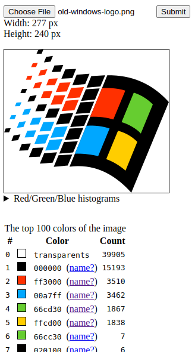

Image color breakdown
=====================

This little application can be used to pick an image apart and to get an breakdown of the colors used in it.
Try it out here: https://zeroone3010.github.io/image-color-breakdown/

This may come in handy when you have got, say, a logo with a few distinctive colors. Sure, you could use any
app with an eyedropper tool, but with this one you'll get all of the colors at once (or at least the 100
most common colors, but that should be plenty).

As an added bonus, next to each color name is a link to [colornames.org](https://colornames.org/) where you can check
whether someone has named that particular color, or name the color yourself!

Here's an example screenshot picking apart the [old Windows logo](https://commons.wikimedia.org/wiki/File:Windows_Logo_%281992-2001%29.svg),
as grabbed from Wikipedia in PNG format:

